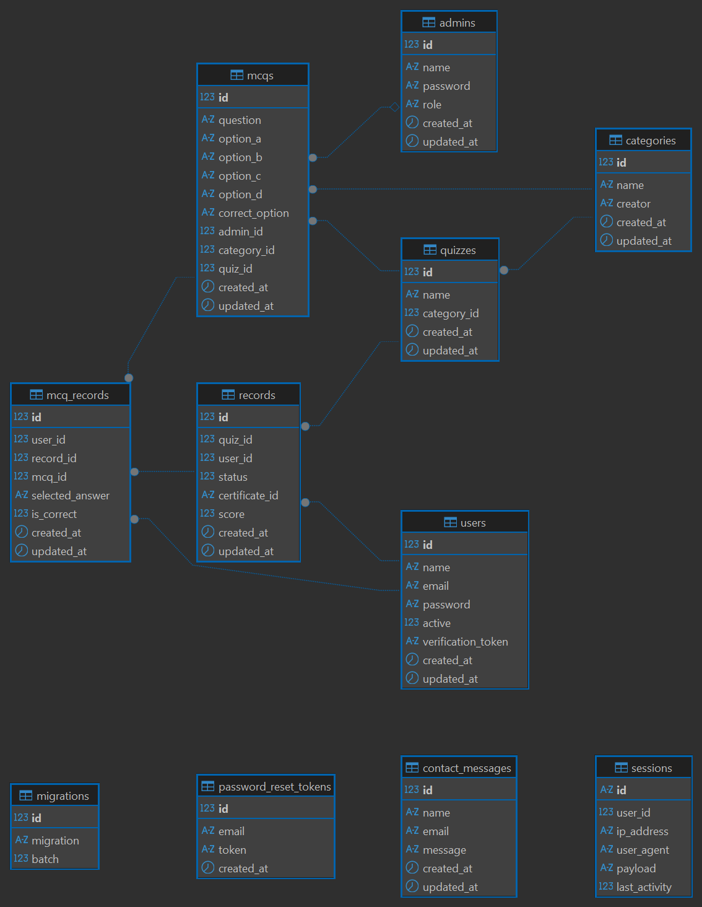

# 02.1 — Database Schema

## 1. Purpose

This schema is derived directly from deployed migrations and production usage, ensuring documentation reflects how the system actually behaves in production, rather than how it was originally designed.

This schema definition is **implementation‑accurate**, based strictly on verified migrations and models—not assumptions—ensuring interview‑grade reliability.

## 2. ER Diagram (Image Reference)

The visual ER diagram below represents the authoritative structural relationships between all entities in the Quizify system.

```markdown

```

## 3. Mermaid Diagram (Text‑Based ERD)

The Mermaid entity‑relationship diagram provides a code‑based view of table relationships, useful for rendering in documentation systems and simplifying revisions.

```mermaid
erDiagram

  USERS ||--o{ RECORDS : "attempts"
  RECORDS ||--o{ MCQ_RECORDS : "answers"
  MCQS ||--o{ MCQ_RECORDS : "referenced"
  QUIZZES ||--o{ MCQS : "contains"
  CATEGORIES ||--o{ QUIZZES : "groups"
  ADMINS ||--o{ MCQS : "author (optional)"

  %% Core tables definitions
  USERS {
    bigint id PK
    string name
    string email
    string password
    tinyint active
    string verification_token
    timestamp created_at
    timestamp updated_at
  }

  RECORDS {
    bigint id PK
    bigint quiz_id FK
    bigint user_id FK
    tinyint status
    string certificate_id
    float score
    timestamp created_at
    timestamp updated_at
  }

  MCQ_RECORDS {
    bigint id PK
    bigint user_id FK
    bigint record_id FK
    bigint mcq_id FK
    string selected_answer
    boolean is_correct
    timestamp created_at
    timestamp updated_at
  }

  MCQS {
    bigint id PK
    text question
    string option_a
    string option_b
    string option_c
    string option_d
    string correct_option
    bigint admin_id (nullable) FK
    bigint category_id FK
    bigint quiz_id FK
    timestamp created_at
    timestamp updated_at
  }

  QUIZZES {
    bigint id PK
    string name
    bigint category_id FK
    timestamp created_at
    timestamp updated_at
  }

  CATEGORIES {
    bigint id PK
    string name
    string creator
    timestamp created_at
    timestamp updated_at
  }

  ADMINS {
    bigint id PK
    string name
    string password
    string role
    timestamp created_at
    timestamp updated_at
  }

  %% Detached auxiliary tables
  CONTACT_MESSAGES {
    bigint id PK
    string name
    string email
    text message
    timestamp created_at
    timestamp updated_at
  }

  PASSWORD_RESET_TOKENS {
    bigint id PK
    string email
    string token
    timestamp created_at
  }

  SESSIONS {
    string id PK
    bigint user_id (nullable)
    string ip_address
    text user_agent
    longtext payload
    integer last_activity
  }
```

## 4. Entities & Responsibilities — Table‑by‑Table

### users

Stores registered user accounts and verification state.

-   Owner of quiz attempts (`records`)
-   Passwords hashed by model casting

Key Responsibilities:

-   Authentication credentials
-   Logical deletion state via `active` flag
-   Verification token for onboarding

---

### admins

Stores administrative creators/editors of MCQs.

-   `admin_id` referenced by `mcqs`

Key Responsibilities:

-   Question authorship and internal management

---

### categories

Provides logical grouping for quizzes.

-   `creator` acts as metadata (string), not enforced FK
-   Drives quiz organization

Key Responsibilities:

-   Top‑level classification of quizzes

---

### quizzes

Represents a quiz container under a category.

-   Parent of MCQs and records

Key Responsibilities:

-   Structural grouping of MCQs
-   Attempt tracking via records

---

### mcqs

Holds question text, options, and correct answers.

-   References quiz, category, and optionally admin

Key Responsibilities:

-   Define question pool
-   Provide answer set and correctness key

---

### records

Represents a user's attempt on a quiz.

-   State: `0=start`, `1=in progress`, `2=completed`
-   Generates certificate reference if completed

Key Responsibilities:

-   Track user progress and score
-   Provide certificate linkage

---

### mcq_records

Stores granular question‑level responses within an attempt.

-   Records correctness per question to avoid recomputation

Key Responsibilities:

-   Core scoring evidence
-   Review and analytics foundation

---

### contact_messages

Stores contact form inquiries from authenticated or guest users.

Key Responsibilities:

-   Retain external communication for support

---

### password_reset_tokens

Stores password‑reset workflow tokens.

-   No FK to users to avoid account enumeration

Key Responsibilities:

-   Secure password recovery token issuance

---

### sessions

Stores authenticated session data using the database session driver.

-   `user_id` nullable to support guests

Key Responsibilities:

-   Persist session state across requests

---

### migrations

Tracks execution order of schema migrations.

Key Responsibilities:

-   Internal Laravel metadata

## 5. Relationship Summary

| Parent     | Child       | Type  | Notes                  |
| ---------- | ----------- | ----- | ---------------------- |
| users      | records     | 1 → N | attempts per user      |
| quizzes    | records     | 1 → N | attempts per quiz      |
| records    | mcq_records | 1 → N | responses per attempt  |
| mcqs       | mcq_records | 1 → N | responses per question |
| quizzes    | mcqs        | 1 → N | questions per quiz     |
| categories | quizzes     | 1 → N | quizzes under category |
| admins     | mcqs        | 1 → N | authorship (optional)  |

Navigation Path:

```
user → record → mcq_record → mcq → quiz → category
```

## 6. Data Integrity & Constraints

-   Cascade deletion preserves referential consistency
-   `mcq_records.is_correct` stored to prevent heavy recomputation
-   `records.certificate_id` unique for shareable certificate referencing
-   `users.active` provides logical deletion without removing history
-   Optional authorship via `admin_id` prevents loss of question content if an admin is removed

## 7. Design Rationale

-   **Two‑layer result model** (`records` + `mcq_records`) enables accurate scoring, review mode, and analytics
-   **Dynamic certificates** avoid storage overhead while supporting unique shareable IDs
-   **No soft deletes** simplifies data model; logical deletion via `active` avoids tombstones
-   **Session storage in DB** centralizes state for production reliability
-   **Correctness stored, not computed** for responsiveness and traceability

## 8. Known Limitations

-   `categories.creator` does not reference admins or users
-   No status workflow for contact messages
-   Minimal indexing may slow analytics under scale
-   Authors removed via `admins` table result in `NULL` authorship for MCQs
-   No archival of old attempts or results

## 9. Future Improvements

-   Enforce creator FK through roles or polymorphic user model
-   Add composite indexes for high‑volume record queries
-   Store generated certificates to S3 or similar object storage
-   Implement attempt‑level retention rules or archival strategy
-   Add lifecycle states to `contact_messages` for support resolution tracking

---

END
