# Production Architecture (05)

This document describes how **Quizify** runs in production on AWS using a cost‑optimized, scalable, and maintainable architecture. The deployment prioritizes stability and clarity while intentionally avoiding unnecessary complexity during the early phase of the project. All architectural choices are designed to safely support future improvements such as autoscaling, S3 integration, and automated database migrations.

---

## 1. Architecture Overview

Quizify runs as a **single Docker container** on **AWS Elastic Beanstalk (EB)** using the **Docker on Amazon Linux 2** platform. Runtime components—NGINX and PHP‑FPM—execute inside the container and are managed using Supervisor. EB provides a **host‑level reverse proxy** that forwards traffic into the container.

The application communicates with an **AWS RDS MySQL** instance for persistence. Environment configuration values—database, email, app key, session settings—are securely supplied through Elastic Beanstalk environment properties.

This architecture balances operational simplicity with production readiness and enables incremental enhancement without disruptive refactors.

---

## 2. High‑Level System Diagram (Mermaid)

```mermaid
graph TD;
    Client --> Cloudflare[Cloudflare/CDN/HTTPS];
    Cloudflare --> EBProxy[Elastic Beanstalk Host NGINX Proxy];
    EBProxy --> CNGINX[Container NGINX];
    CNGINX --> PFPM[PHP‑FPM];
    PFPM --> App[Laravel Application];
    App -->|Private VPC| DB[(RDS MySQL)];
```



---

## 3. Platform & Deployment Characteristics

| Attribute           | Value                                             |
| ------------------- | ------------------------------------------------- |
| Deployment platform | Elastic Beanstalk (single instance mode)          |
| Platform            | Docker running on 64bit Amazon Linux 2            |
| Containerization    | Single container image containing full runtime    |
| Region              | ap‑south‑1                                        |
| Instance type       | t3.micro (free‑tier compatible)                   |
| Deployment trigger  | Push to `main` via GitHub Actions CD              |
| Public access       | via EB domain & Cloudflare fronting custom domain |

This approach minimizes operational overhead while preserving the ability to scale horizontally when needed.

---

## 4. Runtime Container Structure

The Docker image includes:

-   **NGINX** for request handling and static asset serving
-   **PHP‑FPM** as the Laravel execution engine
-   **Supervisor** to manage multi‑process execution in a single container
-   **Composer** installed during image build for dependency resolution

All application source code is copied into the container during build, ensuring deployments are immutable.

---

## 5. Process Management

Supervisor ensures both runtime services stay active and restart automatically if required:

```
[program:php-fpm]
command=/usr/local/sbin/php-fpm --nodaemonize

[program:nginx]
command=/usr/sbin/nginx -g "daemon off;"
```

This model avoids container restarts for transient issues and matches common production practices in PHP containerization.

---

## 6. Request Flow & Networking

Traffic path:

```
Client → Cloudflare → EB NGINX proxy → Container NGINX → PHP‑FPM → Laravel → RDS
```

The **host‑level NGINX** provided by Elastic Beanstalk routes traffic into the container using a reverse proxy configuration. This separation allows future introduction of a load balancer without re‑architecting the container.

Port exposure:

| Port | Purpose                                                      |
| ---- | ------------------------------------------------------------ |
| 80   | HTTP ingress through Cloudflare/EB                           |
| 443  | Allowed externally for HTTPS, termination currently external |
| 22   | Used for controlled SSH access when needed                   |

---

## 7. Database Layer (RDS MySQL)

| Attribute     | Value                                    |
| ------------- | ---------------------------------------- |
| Engine        | MySQL 8.4                                |
| Accessibility | Private VPC only                         |
| Multi‑AZ      | Disabled (early‑stage cost optimization) |
| Storage       | Encrypted SSD with autoscaling enabled   |
| Credentials   | Supplied via EB environment properties   |

Production does not rely on container storage for persistent data; all critical state is stored in RDS.

---

## 8. Storage Strategy

| Asset Type    | Strategy                                    |
| ------------- | ------------------------------------------- |
| Database data | Persistent RDS storage                      |
| App logs      | Ephemeral container filesystem              |
| Sessions      | Database driver (persistent across deploys) |
| User uploads  | Currently none — S3 integration planned     |
| Certificates  | Generated dynamically as needed             |

This ensures no data loss across container rebuilds.

---

## 9. Environment Configuration

Elastic Beanstalk environment properties define:

-   APP_KEY and app settings
-   database credentials
-   email configuration
-   session configuration
-   cache and filesystem settings

Sensitive values are injected through EB and not committed to version control.

---

## 10. Deployment Behavior

Deployments are executed through GitHub Actions using the EB CLI. Each deployment triggers a container rebuild and rollout.

| Activity              | Behavior                    |
| --------------------- | --------------------------- |
| Container rebuild     | Yes, every deploy           |
| Composer run          | During image build          |
| Migrations            | **Manual post‑deploy step** |
| Auto‑artisan commands | **Disabled by design**      |

**Rationale for manual migrations:** the initial production schema originated from imported data, and automatic migrations at this stage may introduce destructive conflicts. Migrations will be automated later as the schema stabilizes.

---

## 11. Scalability & Availability

Current configuration emphasizes predictable low‑cost operation while retaining the ability to scale.

| Capability             | Status                          |
| ---------------------- | ------------------------------- |
| Horizontal scaling     | Supported but disabled          |
| Load balancer          | Disabled (single instance mode) |
| Multi‑instance scaling | Future‑ready                    |
| Multi‑AZ RDS           | Deferred for cost reasons       |

This provides clarity on current constraints without limiting long‑term direction.

---

## 12. Differences vs Local Development

| Aspect             | Local                          | Production                            |
| ------------------ | ------------------------------ | ------------------------------------- |
| Architecture       | Multi‑container Docker Compose | Single container on Elastic Beanstalk |
| DB                 | Local MySQL container          | Managed RDS MySQL                     |
| Storage            | Bind mounts                    | Immutable container image             |
| Process manager    | none                           | Supervisor                            |
| Migration workflow | automatic for dev              | manual for safety in prod             |

---

## 13. Security Posture

| Measure             | Status                                                |
| ------------------- | ----------------------------------------------------- |
| Private DB access   | ✔️ enforced                                           |
| IMDSv2 requirement  | ✔️ required                                           |
| Secrets in ENV only | ✔️                                                    |
| SSH open            | ⚠️ used for controlled access — SSM migration planned |
| HTTPS termination   | 🌐 external via Cloudflare; ALB integration planned   |

Security measures balance effort and immediate needs while outlining a clear upgrade path.

---

## 14. Known Limitations

-   Single‑instance deployment lacks redundancy
-   Manual migration step requires operational discipline
-   No file uploads stored persistently yet
-   HTTPS termination occurs externally
-   SSH access still available; transition to SSM desirable

These items are intentional trade‑offs rather than oversights.

---

## 15. Future Improvements

-   Add S3 for user‑generated assets
-   Automate migrations behind approvals or snapshots
-   Enable load balancer for native HTTPS and HA
-   Move operational access from SSH to SSM Session Manager
-   Introduce CloudWatch custom metrics and alarms for observability

---

## 16. Summary

> _"Quizify runs as a single Docker container on Elastic Beanstalk with NGINX and PHP‑FPM managed by Supervisor. Persistent state is isolated in RDS, while configuration is delivered through environment variables. The deployment intentionally balances cost with safety: migrations are manual to protect imported schema, and the architecture is designed to scale and harden incrementally without rework. The current model is production‑ready for early usage, with a clear roadmap toward higher availability and operational automation."_
