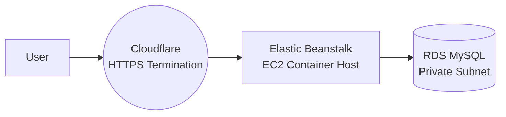

# 06 — AWS Infrastructure

## 1. Purpose

This section documents the AWS infrastructure that supports **Quizify** in production.
It focuses on **what AWS services are used, how they interact, and why the architecture fits early-stage constraints.**

> 🔗 For runtime container internals see: **05 — Production Architecture**
> 🔗 For deployment operations and CD: **08 — CI/CD Pipeline**

---

## 2. AWS Components Overview

| Component               | Service                             | Purpose                                         | Notes                                    |
| ----------------------- | ----------------------------------- | ----------------------------------------------- | ---------------------------------------- |
| Application runtime     | **Elastic Beanstalk (EB)**          | Orchestrates EC2 to run Quizify container       | Single-container mode on Amazon Linux 2  |
| Compute host            | **EC2 (managed by EB)**             | Runs Docker container with the application      | Lifecyle managed by EB platform          |
| Database                | **RDS MySQL**                       | Persistent relational store                     | Private access only, same VPC as EB      |
| Networking              | **VPC + subnets + security groups** | Controls access boundaries                      | DB restricts inbound to EB instance only |
| Public access + HTTPS   | **Cloudflare**                      | Entry point for users, SSL termination, caching | Only Cloudflare IPs allowed to reach EB  |
| Logs                    | **CloudWatch Logs (optional)**      | EB + container logs                             | Integrated via EB platform logging       |
| Monitoring              | **CloudWatch Metrics (optional)**   | Basic health and metrics                        | Future alarms planned                    |
| Object storage (future) | **S3**                              | Uploads & certificates storage                  | Not yet enabled                          |

---

## 3. Architecture Diagram



**Request flow:**

```
Client → Cloudflare → EB NGINX proxy → Container NGINX → PHP-FPM → Laravel → RDS
```

---

## 4. Compute Layer — Elastic Beanstalk

-   **Environment name:** `quizify-env`
-   **Application name:** `quizify`
-   **Platform:** Docker on 64-bit Amazon Linux 2 (`4.4.0`)
-   **Runtime:** Single Docker container (NGINX + PHP-FPM + Supervisor)
-   **Instance type:** `t3.micro` (free-tier compatible)
-   **Provisioning:** Initially manual via `eb deploy`, CD added later
-   **Config extensions:** `.ebextensions/00_nginx_proxy.config` adjusts EB reverse proxy behavior
-   **Logs:** Available via EB console, CloudWatch, or SSH retrieval

**Reasoning:** EB simplifies compute provisioning while maintaining flexibility for future autoscaling.

---

## 5. Database Layer — RDS MySQL

-   **Engine:** MySQL Community Edition
-   **Instance class:** `db.t4g.micro`
-   **Accessibility:** Private subnet, not publicly accessible
-   **Sessions:** Laravel session driver uses MySQL for persistence across deploys
-   **Backups:** Managed by AWS with automated snapshots

**Reasoning:** RDS ensures persistent state beyond ephemeral EC2 storage. Multi-AZ disabled to control cost.

---

## 6. Networking — VPC, Subnets, Security Groups

### VPC & Subnets

-   EB and RDS run in the same VPC to allow private connectivity.
-   RDS placed in private subnets.
-   EB instance reachable publicly only through Cloudflare's IP ranges.

### Security Groups (simplified)

| From                               | To         | Protocol | Purpose                                          |
| ---------------------------------- | ---------- | -------- | ------------------------------------------------ |
| Cloudflare IP ranges → EB instance | HTTP (80)  | HTTP     | Public entrypoint restricted to Cloudflare only  |
| EB instance → RDS                  | MySQL 3306 | MySQL    | Private DB access from application               |
| Temporary admin IP → EB instance   | SSH (22)   | SSH      | Debug/inspection only when required (restricted) |

**Clarification:**

> EB is publicly addressable, but ingress rules allow traffic only if the source matches Cloudflare IP ranges.

---

## 7. Environment Configuration (EB Environment Vars)

Stored securely in EB configuration (not committed to Git):

-   `APP_KEY`
-   `DB_*` credentials
-   `MAIL_*` SMTP settings
-   `SESSION_DRIVER=database`
-   `DB_CONNECTION=mysql`
-   Cache + session configuration

---

## 8. Security Posture

| Security Area | Status                  | Notes                                   |
| ------------- | ----------------------- | --------------------------------------- |
| DB access     | ✔ Private               | Only from EB instance                   |
| HTTPS         | ✔ via Cloudflare        | SSL termination happens at Cloudflare   |
| IMDSv2        | ✔ required              | Default EB platform behavior            |
| Secrets       | ✔ stored in EB          | No secrets in repo                      |
| SSH           | ⚠ Limited manual access | Will be replaced by SSM Session Manager |
| Autoscaling   | ✖ disabled              | Cost-optimized mode                     |

---

## 9. Cost Optimization Strategies

-   Single EC2 instance mode (no autoscaling)
-   No AWS load balancer yet (saves monthly cost)
-   RDS Multi-AZ disabled
-   Cloudflare caching reduces bandwidth and load
-   Minimal AWS surface area early on

---

## 10. Known Limitations

-   No multi-instance redundancy or failover
-   Manual DB migrations required post-deploy
-   HTTPS termination external to AWS
-   SSH access still required for diagnostics
-   No persistent file storage until S3 is enabled

---

## 11. Future Enhancements

| Area        | Planned Improvement                    |
| ----------- | -------------------------------------- |
| Storage     | Enable S3 for uploads + certificates   |
| Networking  | Add AWS ALB + native HTTPS             |
| Reliability | Enable Multi-AZ RDS                    |
| Scaling     | EB auto-scaling groups                 |
| Access      | Replace SSH with SSM Session Manager   |
| Monitoring  | CloudWatch alarms + log centralization |

---

## 12. Summary

> **"Quizify runs on Elastic Beanstalk as a single Docker container fronted by Cloudflare, with persistent data in RDS. Inbound traffic is restricted to Cloudflare IP ranges, and secrets are supplied through EB environment variables. The architecture prioritizes cost efficiency and reliability during the early phase while maintaining a clear upgrade path toward scaling, native HTTPS, persistent object storage, and autoscaling."**

**END — 06-aws-infrastructure.md**
